# transfer learning

这个博客主要是因为最近看了几篇关于无监督迁移学习在行人重识别领域的论文，发现隔了几天，自己对论文就忘记得差不多了，所以对论文的关键内容做个简单记录。

参考链接: [Transfer Learning](https://github.com/layumi/DukeMTMC-reID_evaluation/blob/master/State-of-the-art/README.md)

因为在某些情况下，图片或者公式无法正常显示，所以，我基本会同步到我的博客
<https://tjjtjjtjj.github.io/2018/11/29/person-reid-transfer-learning/#more>

现有方法在transfer learning方向的性能对比

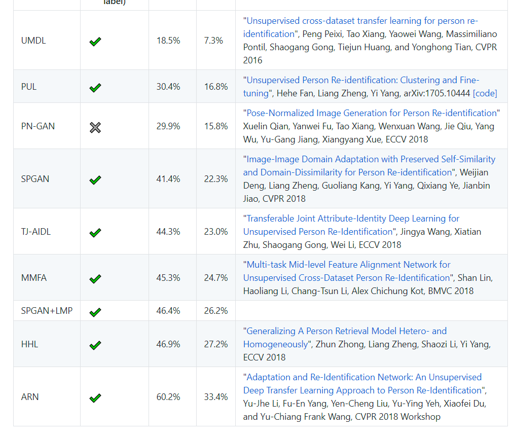
____

## 1. ARN

[Adaptation and Re-Identification Network: An Unsupervised Deep Transfer Learning Approach to Person Re-Identification](http://openaccess.thecvf.com/content_cvpr_2018_workshops/papers/w6/Li_Adaptation_and_Re-Identification_CVPR_2018_paper.pdf)

Yu-Jhe Li, Fu-En Yang, Yen-Cheng Liu, Yu-Ying Yeh, Xiaofei Du, and Yu-Chiang Frank Wang, CVPR 2018 Workshop

这篇论文主要分离了数据集的特有特征和行人特征，从而使不同数据集的行人特征投射到统一特征空间中。

作者是台湾人，没有公布代码。有其他人复现了[代码](https://github.com/huanghoujing/ARN)，但是效果很差。

我下一步也会尝试复现一下。

### 1.1 网络架构

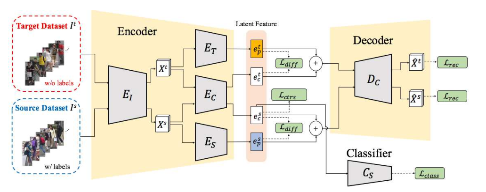

根据作者的描述，

* $E_I$是resnet50的前四个layer,输入是3X256X256,输出$X^s$是2048X7X7
* $E_T,E_C,E_S$,是相同的网络架构，来自FCN的三层，通过查阅FCN的网络设置，初步猜想是FCN的conv6，conv7，conv8，相应的Decoder暂时按照反卷积来设置。这一部分还需要参考FCN的网络设置。
* $E_T,E_C,E_S$ conv6:7X7X2048,relu6,drop6(0.5),conv7:1X1X2048,relu6,drop6(0.5),conv8:1X1X2048,至于conv6,7的bn和conv8的bn，relu要不要，还需要实验的验证
* 在FCN中，逆卷积的使用方式是 deconv(k=64, s=32, p=0)+crop(offset=19)，参考资料:[FCN学习:Semantic Segmentation](https://zhuanlan.zhihu.com/p/22976342?utm_source=tuicool&utm_medium=referral),[经典网络复现系列（一）：FCN](https://blog.csdn.net/zlrai5895/article/details/80473814)
* 反卷积的时候一般都是k=2n, s=n,
* 参考FCN和pytorch的入门与实践第六章的生成器，我们的Decoder使用deconv(k=1,s=1), deconv(k=1, s=1), deconv(k=7, s=1)
* encoder和decoder都使用bn和relu
* 分类层有dropout
* 学习率，$E_I=10^{-7}, E_T E_C E_S D_C = 10^{-3}, C_S = 2*10^{-3}  $，并且在前几个epoch只更新$E_I$
* 优化器：SGD

### 1.2 损失函数

分类损失
$$L_{class}=-\sum_{i=1}^{N_s}y_i^s.log\hat{y}_i^s \tag {1}$$

对比损失
$$L_{ctrs}=\sum_{i,j}{\lambda}(e_{c,i}^s-e_{c,j}^s)^2+ ({1-\lambda}) [max(0, m-(e_{c,i}^s-e_{c,j}^s))]^2 \tag {2}$$

重构误差
$$ L_{rec} = \sum_{i=1}^{N_s} ||X_i^s-\hat{X_i^s}||^2 + \sum_{i=1}^{N_t} ||X_i^t-\hat{X_i^t}||^2 \tag 3 $$

差别损失
$$ L_{diff} = || {H_c^s}^T H_p^s ||_F^2 + || {H_c^t}^T H_p^t ||_F^2 \tag 4 $$

总损失
$$ L_{total} = L_{class} + \alpha L_{ctrs} + \beta L_{rec} + \gamma L_{diff} \tag {5} $$

其中
$$ \alpha=0.01, \beta= 2.0, \gamma=1500 $$

### 1.3 模块分析

三个模块:

1. **$ L_{rec} $**
2. **$ L_{class} $和$ L_{ctrs} $**
3. **$ E_T$和$E_S$**

#### 1.3.1 半监督$ L_{rec} $

这里不是很懂这个重构误差损失函数的作用，下面的这个解释也不行。重构损失是半监督损失函数。暂时理解成重构损失保证在获取特征的过程中尽可能减少信息损失。或者说，类似PCA，保留主成分，这个主成分只能保证尽可能地把样本分开。至于这个主成分是否重要，是否有利于分类，不得而知。

参考链接：[深度学习中的“重构”](https://blog.csdn.net/hijack00/article/details/52238549)

作者在这里提示，当只有重构损失函数的时候，应该保持$E_I$不更新，只更新$E_C$.

S: Market, T: Duke; S: Duke, T: Market

| method    |rank-1| mAP  |rank-1| mAP  |
|:---------:|:----:|:----:|:----:|:----:|
| $L_{rec}$ | 44.5 | 20.3 | 31.2 | 18.4 |

#### 1.3.2 监督$ L_{rec} $, $ L_{class} $和$ L_{ctrs} $

半监督和监督

监督损失使得共享空间捕获到行人语义信息。

S: Market, T: Duke; S: Duke, T: Market

| method                                 |rank-1| mAP  |rank-1| mAP  |
|:-:                                     |:-:   |:-:   |:-:   |:-:   |
| w/o $ L_{class} $, $ L_{ctrs} $        | 52.2 | 23.7 | 36.7 | 19.6 |
| w $ L_{class} $, $ L_{ctrs} $          | 70.3 | 39.4 | 60.2 | 33.4 |
| $L_{rec}$                              | 44.5 | 20.3 | 31.2 | 18.4 |
| $L_{rec}$, $ L_{class} $和$ L_{ctrs} $ | 60.5 | 28.7 | 48.4 | 26.8 |

#### 1.3.3 无监督$ L_{rec} $, $ E_T $和$ E_S $

特有特征的提取是为了去除共享空间的噪声。

假设共享空间存在，且特有特征空间存在，如果没有特有特征的提取，那么得到的行人特征或多或少地都会包含特征空间的基向量。

当然，这里也隐含了一些假设，共享空间和特有空间一定是线性无关的。空间的基向量是2048维。

S: Market, T: Duke; S: Duke, T: Market

| method                        |rank-1| mAP  |rank-1| mAP  |
|:-:                            |:-:   |:-:   |:-:   |:-:   |
| w/o  $ E_T $, $ E_S $         | 60.5 | 28.7 | 48.4 | 26.8 |
| w $ L_{class} $, $ L_{ctrs} $ | 70.3 | 39.4 | 60.2 | 33.4 |
| $L_{rec}$                     | 44.5 | 20.3 | 31.2 | 18.4 |
| $ L_{rec} $, $ E_T $和$ E_S $ | 52.2 | 23.7 | 36.7 | 19.6 |

____

## 2. HHL

[Generalizing A Person Retrieval Model Hetero- and Homogeneously](https://github.com/zhunzhong07/zhunzhong07.github.io/blob/master/paper/HHL.pdf)

Zhun Zhong, Liang Zheng, Shaozi Li, Yi Yang, ECCV 2018

code: <https://github.com/zhunzhong07/HHL>

web: <http://zhunzhong.site/paper/HHL.pdf>

中文: <http://www.cnblogs.com/Thinker-pcw/p/9787440.html>

preson-reid中主要面临的问题：

1. 数据集之间的差异
2. 数据集内部摄像头的差异

解决方法：

1. 相机差异：利用StarGAN进行风格转化
2. 数据集差异：将源域/目标域图片视为负匹配

数据集之间的三元组损失有把不同数据集的行人特征映射到同一特征空间的效果。

创新点在于使用straGAN和复杂的三元组损失。

### 2.1 网络架构

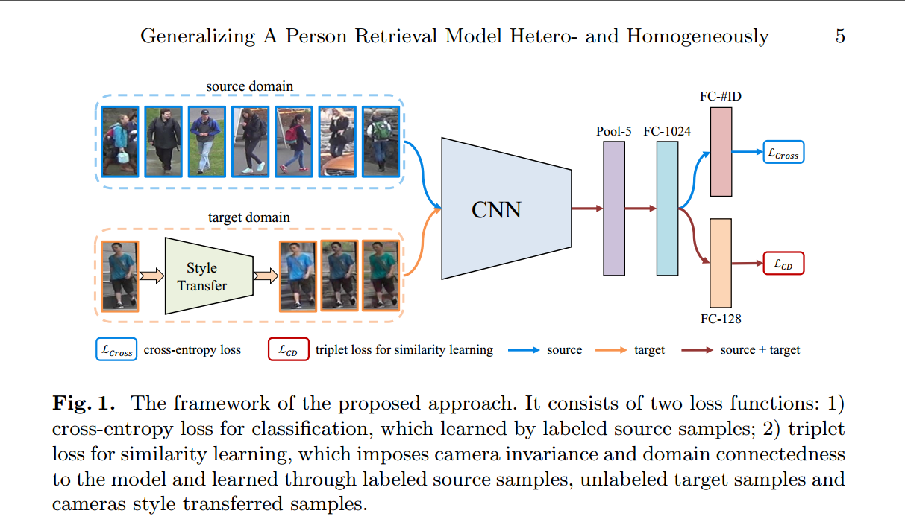

网络的简要介绍

* CNN是resnet50，网络包括两个分支，一个计算源数据集的分类损失，一个计算相似度学习的triplet损失。
* FC-2014的组成：linear(2048，1024)-->bn(1024)-->relu-->dropout(0.5),相当于一个embedding。
* FC-#ID是linear(1024,751), FC-128是linear(1024, 128), 两个分支的具体情况是：
* * x1-->linear(2048, 1024)-->x2-->bn(1024)-->x3-->relu-->x4-->dropout(0.5)-->x5-->linear(102, 751)-->x6
* * x1-->linear(2048, 1024)-->x2-->bn(1024)-->x3-->relu-->x4-->linear(1024, 128)
* 网络的triplet损失是Batch Hard Triplet Loss
* 网络的输入设置：在每一个batch中，对于分类损失，source domain随机选取batchsize=128张图片，对于triplet损失，source domain随机选取8个人的共batchsize=64张图片，其中连续的8张图片属于同一个人，target domain随机选取batchsize=16个人的共16X9=144张图片，假设这16个人都是不同的人。实验发现，当source domain的分类损失的图片比较少的时候，无法实现预期效果，其他情况下没有测试。当batchsize是这样的配比时，可以达到作者的效果。理由未知．
* starGAN是离线训练
* 学习率设置：base：$10^{-1}$，其他：$10^{-2}$，并且每过40个epoch，学习率阶梯性地乘以0.1.一共训练60个epoch就可以达到预期效果，这部分设置和PCB很类似。不知道是经验还是怎么。
* 关于StarGAN待自己复现之后再做进一步解释，现在只复现过StyleGAN。
* triplet损失的margin=0.3

### 2.2 损失函数

分类损失
$$L_{cross}=-\sum_{i=1}^{N_s}y_i^s.log\hat{y}_i^s$$

triplet损失
$$L_T=\sum_{x_a, x_p, x_n}[D_{x_a, x_p}+m-D_{x_a, x_n}]_+$$

相机不变性的triplet损失

目标域中一张原始图片作为anchor，StarGAN图片为positive，其他图片为negative

$$L_C=L_T((x_t^i)^{n_t}\bigcup(x_{t*}^i)^{n_t^*})$$

域不变性的triplet损失

源域中一张图片为anchor，同一id的其他图片作为positive，目标域的任一图片为negative

$$L_D=L_T((x_s^i)^{n_s}\bigcup(x_t^i)^{n_t})$$

相机不变性和域不变性的triplet损失

是将相机不变性和域不变性合为一体，源域的positive不变，negative为源域的其他图片和目标域的图片，目标域的positive不变，negative为源域的图片和目标域的其他行人图片

$$L_{CD}=L_T((x_s^i)^{n_s}\bigcup(x_t^i)^{n_t}\bigcup(x_{t*}^i)^{n_t^*})$$

总损失：
$$L_{HHL}=L_{cross}+\beta*L_{CD}$$

其中：
$$\beta=0.5$$

### 2.3 模块分析

1. **starGAN**
2. **sample方法**

#### 2.3.1 starGAN

在源数据集上训练，在目标数据集上测试不同图像增强方法下的图片距离，通过表格可以得出，预训练的模型对于目标数据集的随机翻转等等有很好的鲁棒性，但是，对于不同摄像头的同一个人，其距离还是很大。因此，利用StarGAN和相机不变性的triplet损失来减少由于摄像头带来的偏差。

| Source | Target | Random Crop | Random Flip | CamStyle Transfer |
|:------:|:------:|:-----------:|:-----------:|:-----------------:|
|Duke    |Market  | 0.049       | 0.034       |0.485              |
|Market  |Duke    | 0.059       | 0.044       |0.614              |

#### 2.3.2 sample方法

对于目标域的取样方法，对比了三种方法的性能，分别是随机取样、聚类取样、有监督取样，通过下图可以看出，这三种方法的性能是一样的，最后，作者给的代码是随机取样。

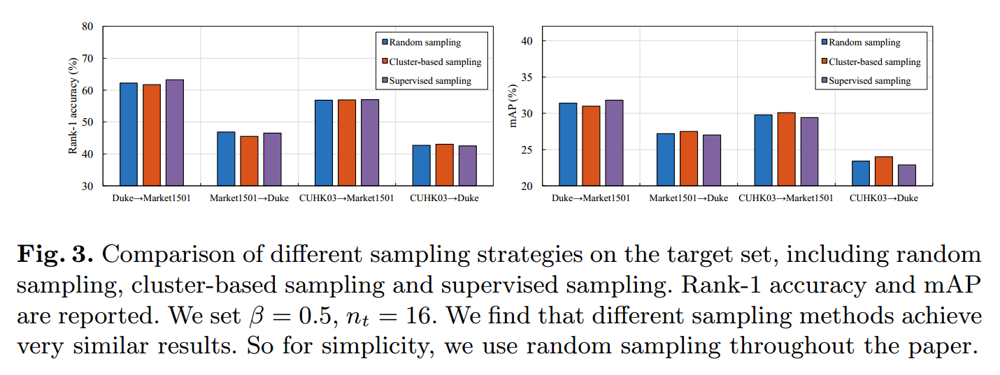

### 2.4 实验设置

#### 2.4.1 Camera style transfer model：StarGAN

使用StarGAN进行对于摄像头风格转化。

* 2 conv + 6 residual + 2 transposed
* input 128X64
* Adam $\beta_1=0.5, \beta_2=0.999$
* 数据初始化:随机翻转和随机裁剪
* 学习率：前100个epoch为0.0001，后100个epoch线性衰减到0

#### 2.4.2 Re-ID model training

* 设置可以参考Zhong, Z., Zheng, L., Zheng, Z., Li, S., Yang, Y.: Camera style adaptation for person re-identification
* input 256*128
* 数据初始化：随机裁剪和随机翻转
* dropout=0.5
* 学习率：新增的层：0.1，base：0.01，每隔40个epoch乘以0.1
* mini-batch：源域上对于IDE为128，对于tripletloss是64.目标域上对于triplet loss是16.
* epoch=60
* 测试：2048-dim计算欧式距离

### 2.5 超参数设置

* triplet loss的权重$\beta$
* 一个batch中目标域上$n_t$的个数

#### 2.5.1 参数的设置$\beta$

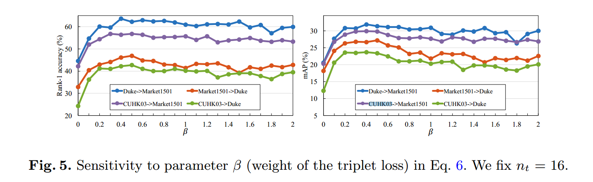

$\beta$应该设置成0.4-0.8

#### 2.5.2 参数的设置$n_t$

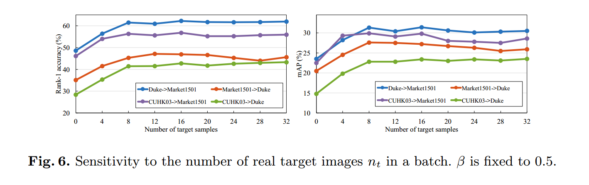

$n_t$在当前设置(源域上对于IDE为128，对于tripletloss是64)下，应该$n_t>16$

通过上述参数的设置，结合自己实验时的错误，不妨这么理解，在固定mini-batch=128的情况下

* 首先引入源域的triplet\_loss，并调整batch和$\beta$，使效果达到最优，,batch的选取2倍数的等间隔，$\beta$可以取等间隔，最后batch=64，即128/2=64，$\beta$则可以先固定成某个值.
* 然后引入目标域的triplet\_loss，并且要先考虑只有目标域的性能，再考虑结合的性能，每次都需要重新考虑$\beta$和batch的大小
* 这么一想，这篇论文做的实验还是很多的。

### 2.6 实验结果

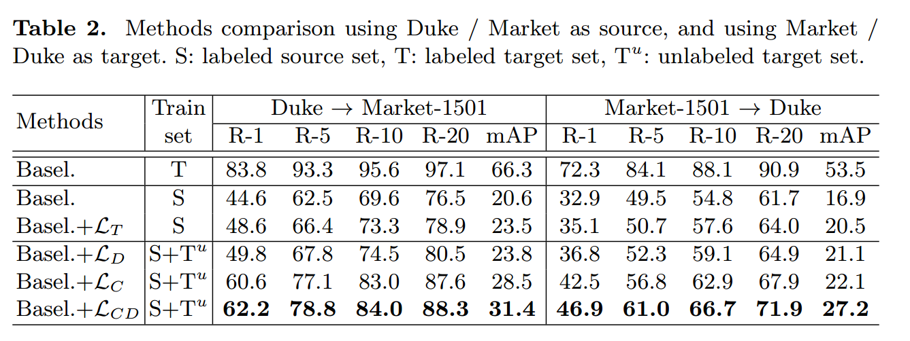

通过结果我们看出来，其实提升的效果主要来源于$L_C$，说明预训练的模型对于目标域不同摄像头的图片鲁棒性很差。

是否说明预训练的模型只学习到了源数据集的跨摄像头的不变行人特征，而对于目标域的摄像头下的不同风格很敏感，而对目标域的同一摄像头下的行人特征很鲁棒。

$L_T$的提升效果很小是否可以说明目标数据集与源数据集的行人特征空间本身就已经很好地重合了，假如tripl\_loss真得具有将不同数据集的行人特征映射到同一特征空间的效果的话。

通过这篇论文，我们能学到的东西很多，比如对比实验，参数设置实验，想法验证实验等等。

###  附录

#### triplet\_loss

发现triplet_loss很厉害的样子，不妨看看是个什么情况。

参考链接：
[Triplet Loss and Online Triplet Mining in TensorFlow](https://omoindrot.github.io/triplet-loss)

[Re-ID with Triplet Loss](http://www.itkeyword.com/doc/2025902251705572502/re-id-with-triplet-loss)

[In Defense of the Triplet Loss for Person Re-Identification](https://arxiv.org/pdf/1703.07737.pdf)

[code](https://github.com/VisualComputingInstitute/triplet-reid)

[Triplet Loss and Online Triplet Mining in TensorFlow](https://omoindrot.github.io/triplet-loss)这个博客讲述了triplet\_loss的起源、发展和具体使用的几种形式。最后的结论是应该使用在线的batch hard策略。

[Re-ID with Triplet Loss](http://www.itkeyword.com/doc/2025902251705572502/re-id-with-triplet-loss)这篇博客则逻辑性地介绍了各种triplet\_loss的变体。最后的结论是batch hard+soft margin效果更好。

也有提及到，triplet\_loss总是不如分类损失强。

#### 下一步工作

已经理解源代码
_____

## 3. SPGAN

[Image-Image Domain Adaptation with Preserved Self-Similarity and Domain-Dissimilarity for Person Re-identification](https://arxiv.org/pdf/1711.07027.pdf)

Weijian Deng, Liang Zheng, Guoliang Kang, Yi Yang, Qixiang Ye, Jianbin Jiao, CVPR 2018

这篇论文主要是构建"Learning via Translation"的框架来进行迁移学习，利用SPGAN(CycleGAN+Simaese net)从源数据集迁移到目标数据集，然后在目标数据集上训练。

论文的重点是怎么改进CycleGAN。

web:<http://www.sohu.com/a/208231404_642762>

code:<https://github.com/Simon4Yan/Learning-via-Translation>

CycleGAN

[Unpaired Image-to-Image Translation Using Cycle-Consistent Adversarial Networks](https://arxiv.org/pdf/1703.10593.pdf)

code:<https://github.com/zhunzhong07/CamStyle>

自己对代码的分析<https://tjjtjjtjj.github.io/2018/11/19/cycleGAN/#more>

### 3.1 前言

一般的无监督迁移方法都是假设源域和目标域上有相同ID的图片，不太适用于跨数据集的行人重识别。

### 3.2 网络架构

GAN网络

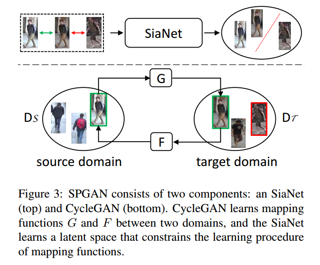

LMP网络
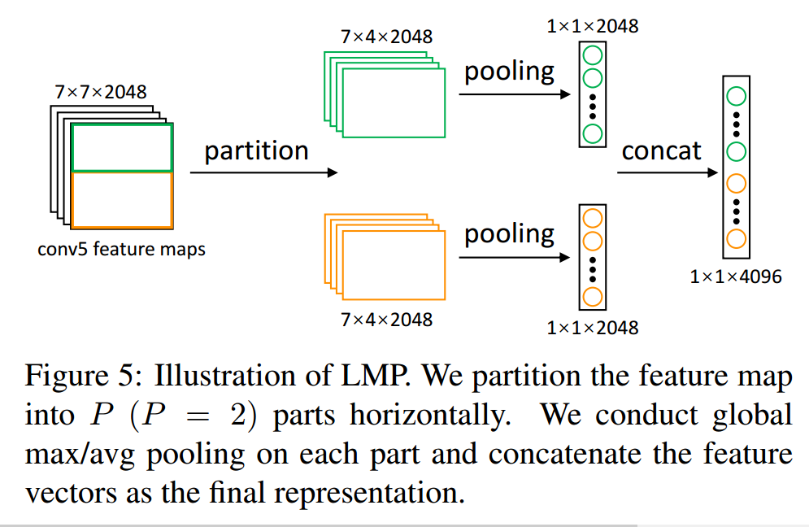

行人重识别整体网络
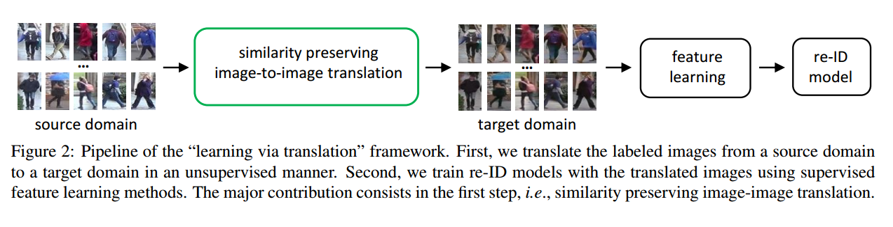

网络的简要介绍

* 整理网络由两部分组成，第一部分是SPGAN，第二部分是常见的行人重识别网络的修改版LMP，重点是第一部分。
* 整个网络是用Caffe搭建。
* 因为自己没有仔细看caffe的代码，后期有需要的还是要看看超参数设置的。
* SPGAN基本沿用了CycleGAN的设置，epoch=5，更多的epoch没有用。
* SPGAN的正样本是$x_S$和$G(x_S)$或者$x_T$和$F(x_T)$,负样本是$G(x_S)$和$x_T$或者$F(x_T)$和$x_S$，作者给的代码中用的正样本是$x_S$和$G(x_S)$或者$x_T$和$F(x_T)$，负样本是$x_S$和$x_T$。
* SPGAN的训练分为生成器、判别器、SiaNet。
* $L_{ide}$可以保持转换前后图片颜色保持一致。
* LMP网络直接generated domain上训练。
* 在论文的tabel2的注释中，可以看到是分成了7份，与PCB的6份差不多。

### 3.3 损失函数

#### 3.3.1 CycleGAN

$$L_{T_{adv}}(G,D_T,p_x,p_y)=E_{y\sim p_y}[(D_T(y)-1)^2]+E_{x\sim p_x}[(D_T(G(x))-1)^2]$$
$$L_{S_{adv}}(F,D_S,p_x,p_y)=E_{x\sim p_x}[(D_S(x)-1)^2]+E_{y\sim p_y}[(D_S(F(y)))^2]$$
$$L_{cyc}(G,F)=E_{x\sim p_x}\parallel F(G(x))-x \parallel_1+E_{y\sim p_y}\parallel G(F(y))-y\parallel_1$$
$$L_{ide}(G,F,p_x,p_y)=E_{x\sim p_x}\parallel F(x)-x\parallel_1+E_{y\sim p_y}\parallel G(y)-y\parallel_1$$

#### 3.3.2 SPGAN

Siameses Net:
$$L_{con}(i,x_1,x_2)=(1-i)(max(0,m-d))^2+id^2$$
其中，$m\in [0,2]$，$d=1-cos(\theta)\in [0,2]$表示归一化后的欧式距离.正样本是$x_S$和$G(x_S)$或者$x_T$和$F(x_T)$,负样本是$G(x_S)$和$x_T$或者$F(x_T)$和$x_S$。

Overall objective loss:
$$L_{sp}=L_{T_{adv}}+L_{S_{adv}}+\lambda_1 L_{cyc}+\lambda_2 L_{ide}+\lambda_3 L_{con}$$
其中，$\lambda_1=10，\lambda_2=5，\lambda_3=2, m=2$

#### 3.3.3 行人重识别网络

以resnet50为基础网络，和PCB类似，分割成两块。

### 3.4 实验设置

#### 3.4.1 SPGAN

SPGAN的整体训练过程与CycleGAN基本是一致的，建议先参考CycleGAN，再学习SPGAN。

$\lambda_1=10，\lambda_2=5，\lambda_3=2, m=2$，学习率为0.0002，batch=1，total\_epoch=5

**SiaNet:** 

4个conv+4个max pool+1个FC。

x(3,256,256)->conv(3,64,k=(4,4),s=2)->max pool(k=(2,2),s=2)

->conv(64,128,k=(4,4),s=2)->max pool(k=(2,2),s=2)

->conv(128,256,k=(4,4),s=2)->max pool(k=(2,2),s=2)

->conv(256,512,k=(4,4),s=2)->max pool(k=(2,2),s=2)(1,1,512)

->FC(512, 128)->leak\_relu(0.2)->dropout(0.5)->FC(128,64)

输入预处理：随机左右翻转、resize(286)、crop(256)、img/127.5-1。

激活函数全部使用leak\_relu(0.2)，没有使用bn

```python
def metric_net(img, scope, df_dim=64, reuse=False, train=True):

    bn = functools.partial(slim.batch_norm, scale=True, is_training=train,
                           decay=0.9, epsilon=1e-5, updates_collections=None)

    with tf.variable_scope(scope + '_discriminator', reuse=reuse):
        h0 = lrelu(conv(img, df_dim, 4, 2, scope='h0_conv'))    # h0 is (128 x 128 x df_dim)
        pool1 = Mpool(h0, [1, 2, 2, 1], [1, 2, 2, 1], padding='VALID')

        h1 = lrelu(conv(pool1, df_dim * 2, 4, 2, scope='h1_conv'))  # h1 is (32 x 32 x df_dim*2)
        pool2 = Mpool(h1, [1, 2, 2, 1], [1, 2, 2, 1], padding='VALID')

        h2 = lrelu(conv(pool2, df_dim * 4, 4, 2, scope='h2_conv'))  # h2 is (8 x 8 x df_dim*4)
        pool3 = Mpool(h2, [1, 2, 2, 1], [1, 2, 2, 1], padding='VALID')

        h3 = lrelu(conv(pool3, df_dim * 8, 4, 2, scope='h3_conv'))  # h3 is (2 x 2 x df_dim*4)
        pool4 = Mpool(h3, [1, 2, 2, 1], [1, 2, 2, 1], padding='VALID')

        shape = pool4.get_shape()
        flatten_shape = shape[1].value * shape[2].value * shape[3].value
        h3_reshape = tf.reshape(pool4, [-1, flatten_shape], name = 'h3_reshape')

        fc1 = lrelu(FC(h3_reshape, df_dim*2, scope='fc1'))
        dropout_fc1 = slim.dropout(fc1, 0.5, scope='dropout_fc1')  
        net = FC(dropout_fc1, df_dim, scope='fc2')

        #print_activations(net)
        #print_activations(pool4)
        return net
```

#### 3.4.2 LMP

batch\_size=16, total\_epoch=50, SGD, momentum=0.9, gamma=0.1, lr_ini=0.001, decay to 0.0001 after 40 epochs.

这部分的设置和IDE基本类似。

### 3.5 对比实验

**模块的对比实验**
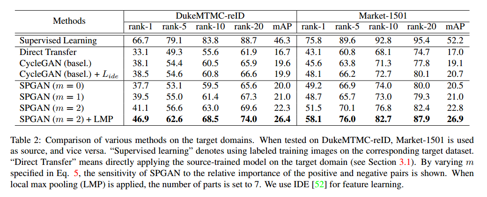
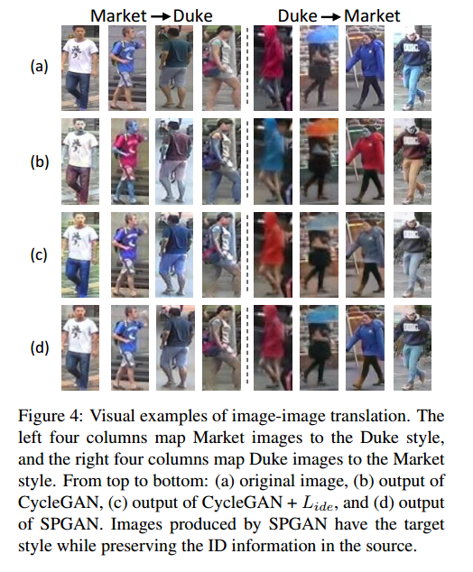

通过对比实验可以看到，以mAP为指标，CycleGAN增加了3个点，SiaNet(m=2)增加了3个点，LMP增加了4个点。说明作者尝试的3个模块都在一定程度上起到了作用。但是个人感觉还是差点什么。比如，为什么会有效？

假设目标都是为了使源域与目标域的行人特征映射到同一特征空间。这里的CycleGAN做到了这一点。LMP可以认为是加在哪里都有效的一种方式。那SiaNet其实更像是在保证生成的图片不仅要保留源图片的内容，更要保留源图片的行人特征。这种保留是以一种隐空间的形式在保存，而不是明显的分类损失这样子。

$\lambda_3 $对比实验

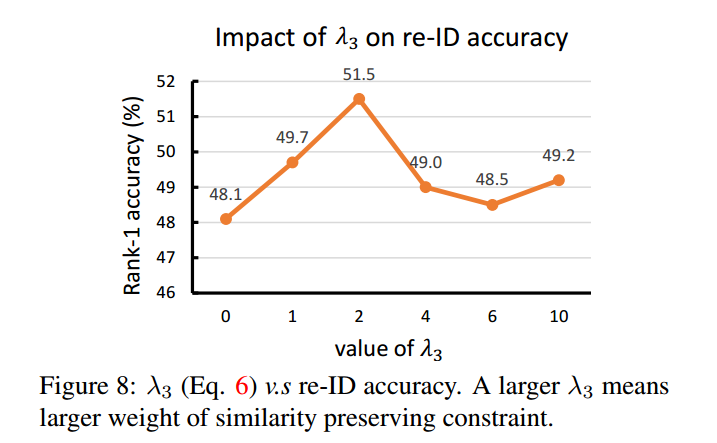

pool 和 part的对比实验

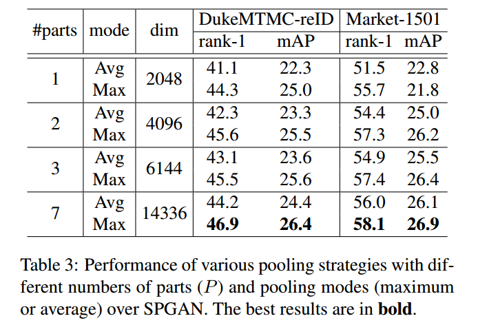

也就是说，pool的方式和parts的取法是实验得到的，不是凭空想出来的。

通过上述实验超参数的设置对比实验，与HHL论文比较，都是固定其他，变化一个参数，然后选取最优的参数，是基于局部最优就是全局最优的思想。感觉到作者的实验做得很足。

不同base model的对比实验

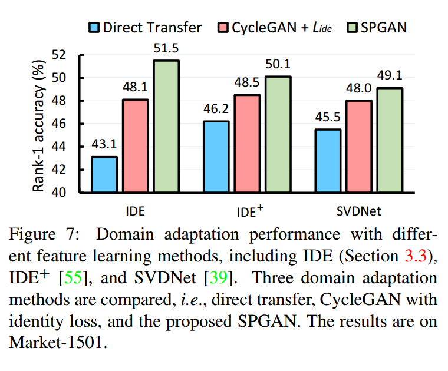

### 附录

#### IDE and $IDE^+$

[IDE](https://arxiv.org/pdf/1604.02531.pdf)

<https://github.com/zhunzhong07/IDE-baseline-Market-1501>
> We name the descriptor as ID-discriminative Embedding (IDE).
感觉还是没有很好地理解IDE。

对于IDE+没有找到对应的原文，因为不是重点，暂且跳过。

IDE的pytorch代码

<https://github.com/Simon4Yan/Person_reID_baseline_pytorch>

IDE和$IDE^+$的网络模型是一样的：

resnet50(layer4)+avgpool+Linear(2048,512)+bn1d(512)+LeakReLU(0.1)+Dropout(0.5)+Linear(512, num_class)

区别在于训练时bn层是否更新：

```python
# model.model = resnet50(layer4)+avgpool+Linear(2048,512)+bn1d(512)+LeakReLU(0.1)+Dropout(0.5)
# model.classifier = Linear(512, num_class)
# IDE
for phase in ['train', 'val']:
    if phase == 'train':
        scheduler.step()
        model.train(True)  # Set model to training mode
    else:
        model.train(False)  # Set model to evaluate mode
# IDE+
for phase in ['train', 'val']:
    if phase == 'train':
        scheduler.step()
        model.eval()  # Fix BN of ResNet50
        model.model.fc.train(True)
        model.classifier.train(True)
    else:
        model.train(False)  # Set model to evaluate mode
```

#### Caffe and pytorch

[Caffe和pytorch中的bn层的计算方式不一样。](https://github.com/Simon4Yan/Learning-via-Translation/issues/1)

在caffe中，bn层在训练时是eval状态，也是只使用Imagenet的mean和variance
> The eval mode for BN layer during training, corresponding to Caffe's batch_norm_param {use_global_stats: true}, means using ImageNet BN mean and variance during training.

在pytorch中，bn层在训练时如果设置成eval装填，才可以达到caffe的精度。

#### 疑惑

IDE和IDE+的效果区别为什么会这么大?

### 下一步工作

* [x] 已经理解源代码

尝试在pytorch上复现结果，现在根据作者提供的代码，感觉并不是很难。主要是SPGAN。

______________

## 4. 基于GAN的类似论文

类似的采取GAN做person-reid方向的论文还有好多，上面两篇是现在最新的，下面就简单地介绍几篇类似的文章，其中涉及到的原理和前文提到的GAN的方法类似。

### 4.1 PTGAN

[Person Transfer GAN to Bridge Domain Gap for Person Re-Identification](https://arxiv.org/pdf/1711.08565.pdf)

Longhui Wei1, Shiliang Zhang1, Wen Gao1, Qi Tian

这篇论文对Cycle-GAN进行了改进，保留ID信息的损失函数如下：
$$L_{ID}=E_{a \sim p_{data}(a)} [||(G(a)-a) \odot M(a)||_2] + E_{b \sim p_{data}(b)} [||(F(b)-b) \odot M(b)||_2]$$

其中，$M(b)$表示使用PSPNet分割后的结果。

转化效果如下图所示

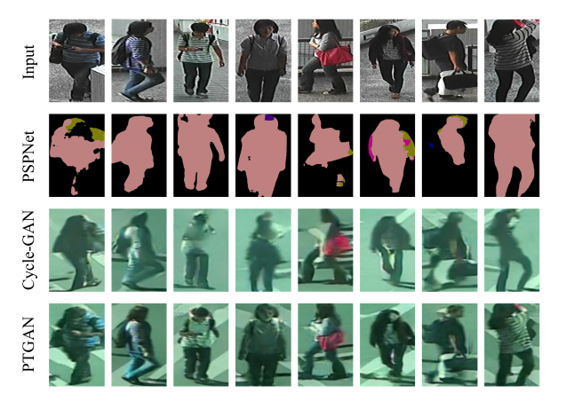

这里的Cycle-Gan生成图片的效果和SPGAN生成的效果还是有一些区别的，不是很理解。

其他的不是本次的重点，不做介绍。

### 4.2 DCGAN+CNN

[Unlabeled Samples Generated by GAN Improve the Person Re-Identification Baseline in Vitro](https://arxiv.org/pdf/1701.07717.pdf)

Zhedong Zheng Liang Zheng Yi Yang

这篇论文主要是利用DCGAN生成新的数据集进行数据集扩充。

网络架构如图所示：

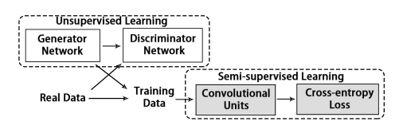

生成效果图

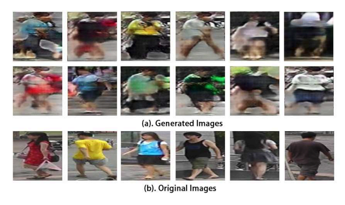

生成图片的标签LSRO
$$q_{LSR}=\begin{cases} \frac{\epsilon}{K},k\neq y\\
                        1-\epsilon+\frac{\epsilon}{K},k=y \end{cases}$$
$$l_{LSR}=-(1-\epsilon)log(p(y))-\frac{\epsilon}{K}\sum_{k=1}^{K}log(p(k))$$
$$q_{LSRO}=\frac{1}{K}$$
$$l_{LSRO}=-(1-Z)log(p(y))-\frac{Z}{K}\sum_{k=1}^Klog(p(k))$$
其中，真实图片的Z=0，生成图片的Z=1.
